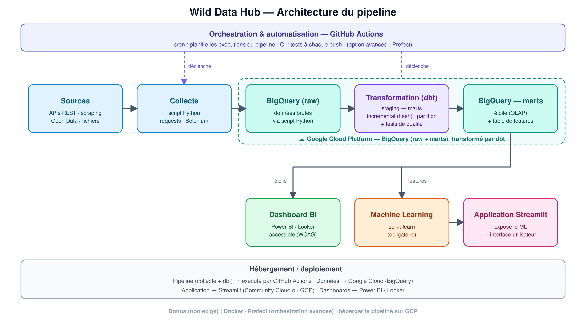

## Introduction et Contexte

{: .text-center }

Bienvenue dans **Wild Data Hub** : une vraie aventure dans le monde de la donnée ! Pendant les prochaines semaines, vous allez construire **de A à Z votre propre application d'analyse de données**, de la collecte jusqu'à la restitution devant un public.

Le plus cool ? **C'est vous qui choisissez votre sujet et vos sources de données.** Que vous soyez branché·e business, industrie, finance, sport, environnement, médias sociaux, musique, cinéma, jeux vidéo… ou tout autre domaine qui vous passionne, vous orienterez le projet dans cette direction.

L'idée est simple : **vous êtes libres sur le QUOI, on vous guide sur le COMMENT.** Tout le monde suivra le même fil rouge — collecter, transformer, stocker, analyser, modéliser, visualiser, restituer — pour pouvoir avancer ensemble et s'entraider. Vous êtes des **Data Analysts** maintenant : vous savez de quoi on parle. 🚀

> **À retenir dès le départ :** ce projet est votre support principal pour valider les compétences de votre **certification (RNCP38616, option Data Analyse)**. La gestion de projet et le Machine Learning ne sont pas des options : ils sont **au cœur des critères d'évaluation** requis pour obtenir votre titre.

> Pour ce projet, les fichiers CSV tout prêts téléchargés sur Kaggle sont interdis. Vous devez aller chercher la donnée à la source.
La règle : Collecte obligatoire via une ou plusieurs APIs (Spotify, OpenWeather, Alpha Vantage, etc...).

## Objectifs Pédagogiques

- Collecter des données à partir d'une ou plusieurs **APIs**.
- Charger les données **brutes (JSON) directement dans BigQuery** (zone *raw*), où le JSON devient lignes/colonnes (détection de schéma).
- À chaque collecte hebdomadaire, **éviter les doublons** : un **hash (en Python) des colonnes clés** permet de n'ajouter que les nouvelles lignes.
- Comprendre la distinction **data lake / data warehouse** (et pourquoi, à plus grande échelle, on déposerait d'abord les fichiers bruts dans un stockage objet comme GCS ou S3).
- **Explorer** les données avec **Python (pandas)**, et **préparer en Python le jeu de données destiné au Machine Learning** (features).
- **Transformer et modéliser** les données pour l'analyse en **schéma en étoile (OLAP)**, avec **dbt (ou du SQL)** — et fiabiliser avec quelques **tests**.
- Construire des **tableaux de bord décisionnels accessibles** (Power BI ou Looker Studio).
- Entraîner et évaluer un **modèle de Machine Learning** (scikit-learn).
- Exposer le tout dans une **application Streamlit**.
- Mener le projet en **méthodologie Agile** (Scrum Master tournant), en intégrant **veille, éthique, RGPD, AI Act, impacts environnementaux et sociétaux**

## Organisation

Le projet se déroule sur **7 semaines actives**, suivies de **2 semaines de préparation à la certification**, en mode **itératif et collaboratif (Agile)**.

- **Groupes de 3 à 4.**
- **Sujet libre**, choisi par le groupe. Deux pistes vous sont proposées plus bas **si vous n'avez vraiment aucune idée** — mais ce ne sont que des idées d'API : à vous de creuser et de définir votre angle.
- **Outils de suivi** : un espace **Notion ou Trello d'équipe** (backlog, kanban, cahier des charges, registre des risques, planning) **+ une page perso par membre** (votre code, votre dashboard, votre ML, votre journal de décisions).

## Travailler en équipe : collectif ET individuel

C'est la règle d'or du projet, alors lisez-la deux fois :

- **En amont, c'est collectif.** L'équipe construit **ensemble l'infrastructure partagée** : collecte, pipeline, base de données.
- **En aval, c'est individuel.** À partir de la base commune, **chaque membre tient sa propre « tranche verticale »** : ses requêtes et son analyse exploratoire, **son dashboard BI**, **son modèle de ML** (vous pouvez même choisir des ML différents !), **sa page Streamlit**.

Pourquoi ? Parce que la certification **évalue chacun·e individuellement**. On ne laisse donc pas la personne la plus à l'aise tout faire : chacun·e doit pouvoir présenter et défendre sa partie devant le jury.

## Déroulé semaine par semaine

Vous avez **7 semaines de production** (S13 → S19), puis **2 semaines de préparation à la certification** (S20-S21). Voici ce que vous devez produire chaque semaine — côté projet et côté gestion de projet.

| Semaine | Cours étudiés| A la fin de la semaine vous devez avoir |
|---|---|---|
| **S13** · 3-7 août | Design thinking   GCP   Gestion de projet agile   Notion | Equipe constituée   Sources de données identifiées   Atelier design thinking terminé   Notion créé |
| 10-14 août | — *(fermé)* | — |
| 17-21 août | — *(fermé)* | — |
| **S14** · 24-28 août | DBT   Gestion des risques partie 1   Cahier des charges|Exploration des données   Script et données chargées dans Bigquery   Atelier collectif : brainstorming gestion des risques RGPD |
| **S15** · 31 août-4 sept | Github Actions   Prefect   Docker | Script enrichi avec l'architecture OLAP - DBT |
| **S16** · 7-11 sept | Clean code et refactorisation   Gestion des risques partie 2 | revue de mi-projet   Cahier des charges à jour   Notion à jour|
| **S17** · 14-18 sept |Risques techniques / environnementaux / sociétaux + positionnement   AI Act | Code clean et automatisé via Github actions   Atelier collectif de gestion des risques mis à jour (sociétal, environnemental) | démarrage du **dashboard BI** |
| **S18** · 21-25 sept | **Modèle de Machine Learning** (un par personne) + **application Streamlit** + hébergement du code | Pilotage |
| **S19** · 28 sept-2 oct | Prépa démo ; **documentation** (schéma OLAP) ; **soutenance** | Synthèse finale des risques (mitigation, audit) ; recommandations |
| **S20** · 5-9 oct | Revue des livrables, **soutenance blanche** | Bilan et ajustements |
| **S21** · 11-15 oct | Préparation finale à la certification | — |

> 💡 **L'« IA » de ce projet, c'est le Machine Learning, et il est obligatoire.** Il s'agit de **ML classique avec scikit-learn** (régression / classification / clustering). Les fonctionnalités à base de LLM (Gemini & co.) restent un **bonus facultatif**.

> 🧰 **Culture perso / bonus (non exigé)** : si votre groupe est à l'aise, vous pouvez explorer **Docker** (conteneurisation), **Prefect** (orchestration avancée) et l'**hébergement sur GCP**. À ne tenter qu'une fois le pipeline de base solide.

> 💡 **Le conseil du coach sur le choix du sujet :**
> Les APIs et les sources Open Data vous donnent accès à des millions et des millions de lignes. Ne tombez pas dans le piège de vouloir aspirer la Terre entière. Vous n'avez que 7 semaines de production. 

> **Appliquez la stratégie du MVP (Minimum Viable Product)** : restreignez immédiatement votre scope. Concentrez-vous sur un secteur (ex : l'immobilier uniquement à Lille), un domaine strict, ou une cible précise. 

> Pour valider les compétences de la certification RNCP, le volume brut de votre base de données n'est pas le critère essentiel. L'évaluation repose avant tout sur votre capacité à présenter un pipeline automatisé, propre, testé sur dbt et un modèle de ML qui tourne. Mieux vaut un projet ciblé, soigné et totalement fonctionnel de bout en bout, qu'une usine à gaz nationale qui plante à la moitié du pipeline.

## Les cours en parallèle

Vous ne serez jamais lâché·es seul·es face à la technique : les cours arrivent **au fil de l'avancement** du projet — notamment GCP / BigQuery, la gestion de projet Agile, dbt, GitHub Actions... Docker et Prefect sont abordés en **culture perso**.

## Missions et Livrables Attendus

**Livrables collectifs (équipe)**
 
- Cahier des charges + backlog (Notion / Trello).
- Registre des risques (éthique, RGPD, environnement, société).
- Documentation technique + **schéma OLAP** (modèle en étoile) de la base.

  
**Livrables individuels (chaque membre)**
 
- **Votre script de collecte / extraction** (pour la ou les source(s) dont vous êtes responsable).
- **Pipeline ELT unifié** : intégration de toutes les sources → BigQuery + dbt, automatisé.
- Votre analyse exploratoire (stats descriptives, valeurs anormales traitées).
- **Votre dashboard BI** (Power BI ou Looker, accessible WCAG).
- **Votre modèle de ML** (scikit-learn) + évaluation par métriques.
- **Votre application Streamlit** exposant le modèle.
- Votre page perso (journal de contributions et de décisions).
- Votre participation à la soutenance.

  
## Méthodologie & bonnes pratiques
 
- Avancez en **Agile** : backlog, user stories, kanban, points d'étape réguliers.
- **Scrum Master tournant** : chaque semaine, un·e membre différent·e prend le rôle — il/elle anime les rituels (daily, revue, rétro) et tient le kanban à jour. Comme ça, tout le monde passe par la facilitation au moins une fois.
- **Documentez** au fur et à mesure (code, choix techniques, schéma de base).
- Pratiquez une **veille** : chaque choix d'outil doit s'appuyer sur une source crédible.
- Tenez un **registre des risques** vivant : biais, RGPD, **AI Act** (où se situe votre projet sur l'échelle de risque ?), impact environnemental (sobriété numérique) et sociétal.
- Utilisez **Git** (versioning, branches, pull requests) dès le début.
- Soignez l'**accessibilité** de vos rendus (couleur, taille de texte — critères WCAG).

## Pas d'idée de sujet ? Deux pistes (juste des idées d'API)

⚠️ **Ce ne sont que des points de départ.** Les APIs ci-dessous n'ont **pas été testées** : à vous de vérifier qu'elles fonctionnent, de définir votre problématique et de vous casser la tête sur l'angle. Vous restez libres de partir sur tout autre sujet.

**Piste A — WildFuelAnalytics** *(analyse des prix des carburants et concurrence)*
Idées de données : API officielle des prix des carburants en France (disponible en temps réel sur data.gouv.fr ou via l'API dynamic-fuel) + API OpenStreetMap/Overpass (pour calculer les distances avec les stations concurrentes et la densité urbaine).
Exemples d'analyses : Cartographie dynamique des prix des carburants, analyse des marges et de la guerre des prix selon la proximité des stations concurrentes (ex: Total vs Leclerc), impact des axes routiers (autoroutes vs nationales) sur les tarifs pratiqués.
Machine Learning (ML) : Modèle de régression pour prédire le prix au litre d'une station en fonction de ses concurrents locaux, de sa marque, de son emplacement géographique et du cours du pétrole.

**Piste B — WildFindJob** *(analyse du marché de l'emploi dans la data)*
Idées de données : APIs d'offres d'emploi + web scraping. 
Exemples d'analyses : tendances des offres, compétences les plus demandées, géographie de l'emploi. 
ML possible : recommandation d'offres, détection de tendances.

## Ressources

- [Liste non-exhaustive d'idées d'APIs](https://docs.google.com/document/d/1HZcOZ60cGACjA56UJY5l-vTVvXdguJNhL4woeXBPtJo/edit?usp=sharing)
- [dbt — documentation](https://docs.getdbt.com/)
- [Streamlit](https://www.youtube.com/@CodingIsFun/playlists)
- [scikit-learn — guide utilisateur](https://scikit-learn.org/stable/user_guide.html)
